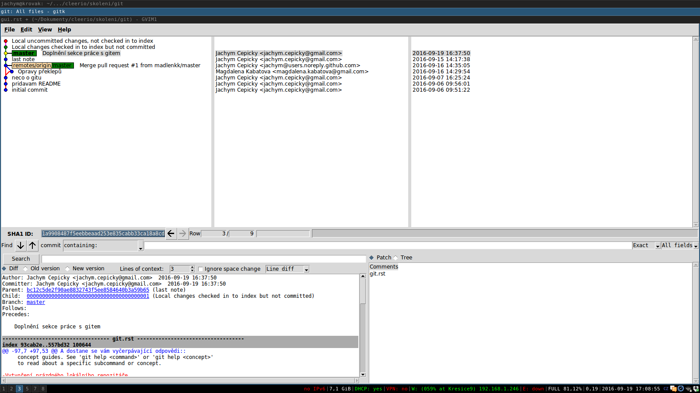

Grafické uživatelské rozhranní
==============================

Není moc lidí, co si vystačí se základní sadou příkazů v konzoli a k tomu
několika příhodnými aliasy. Lidé chtějí změny vidět. Různá vývojová prostředí a
textové editory obsahují sadu nástrojů pro práci s GIT a pro vizualizaci změn.

Samozřejmě lze doporučit zejména textový editor `VIM <http://vim.org>`_ a
rozšíření `Fugitive <http://pyladies.cz/v1/s009-git/git.html>`_. VIM si určitě
nastavte jako editor pro řešení konfliktů ::

    $ git config --global diff.tool 'gvimdiff'
    $ git config --global merge.tool 'gvimdiff'

Pro ty z vás, kteří se s VIMem moc nekamarádí, lze doporučit program `gitk`,
který používá dokonce i Pavel. Spouští s příkazem ::

    $ gitk --all
    Program 'gitk' v současnosti není nainstalován. Můžete jej nainstalovat napsáním:
    sudo apt install gitk

Parametr `--all` zajistí, že klikátko zobrazí všechny větve. .. Ještě před tím
musíme `gitk` nainstalovat...

Jak vidíte, grafické rozhraní nečiní práci s gitem nijak předhlednější ani
jednodušší natož příjemnější.

    
